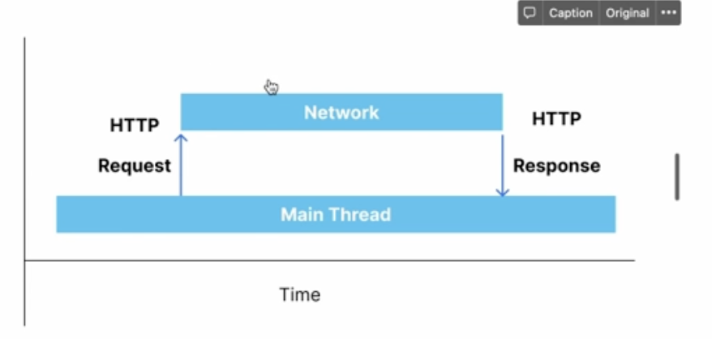

# 👩🏻‍💻네트워크 이해하기

### Concurrency(동시성)
- 여러개의 작업이 동시에 일어나 보이도록 하는 것
- 작업들이 순서에 상관없이 동시에 수행될 수 있음
- 밥먹으면서 공부하기
  - 실제로는 동시에 진행되지않음
  - 밥 한숟가락 -> 두줄 -> 한숟가락 -> 두줄

### Tread
- 각각의 작업들은 쓰레드에서 실행됨
- **⭐️메인 쓰레드⭐️ : 화면 표시 및 사용자 인터랙션을 받는 작업 수행**
  - 데이터를 화면에 보여주기
  - 버튼 클릭 이벤트 감지
- **백그라운드 : 메인 쓰레드 외에 작업들**
  - 네트워크에서 데이터를 다운받을 때나
  - 디비에서 데이터를 읽어 온다던가
- **custom : 지정된 스레드를 통해서 작업할 때 사용**
  - 카메라를 통해서 들어온 영상 데이터 가공시
  - 오디오 데이터 변조시 

### Async(비동기) vs Sync(동기) Task

- 동기
  - 요청과 리턴이 같음
- 비동기
  - 요청과 리턴이 동시가 아님 
  - 앞의 작업이 끝나지 않았는데 시작할 수 있다. 
  
- 실제 사용에서

- 특히 네트워크 사용시

- 서버에 요청 -> 네트워크 사용중 -> 서버의 응답

### HTTP
- 무엇?
  - 서버와 대화하는 방식
  - 통신 규약
  - 프로토콜
  - 데이터 요청
  - 데이터 응답

- 데이터 요청
  - URL 이란?
  
  - 서버에 데이터를 요청하기 위해 입력하는 영문 주소
  - 마지막은 요청 쿼리 아이템(질의문)

- 요청 메소드
  - GET : 존재하는 자원에 대한 요청
  - POST : 새로운 자원을 생성
  - PUT : 존재하는 자원에 대한 변경
  - DELETE : 존재하는 자원에 대한 삭제

- 데이터 응답
  - status cod
    - 2xx : 성공
    - 3xx : 리다이렉션 메시지
      - 해당 데이터가 없다.
    - 4xx : 클라이언트 에러
    - 5xx : 서버 에러
- body (요청한 데이터들)
  - JSON
  - Image

- 요약
  - 요청시 : URL + Request Method가 필요
  - 응답시 : Status Code + Response Body(JSON)으로 처리 

  - postman tool : http 를 상세하게 확인가능