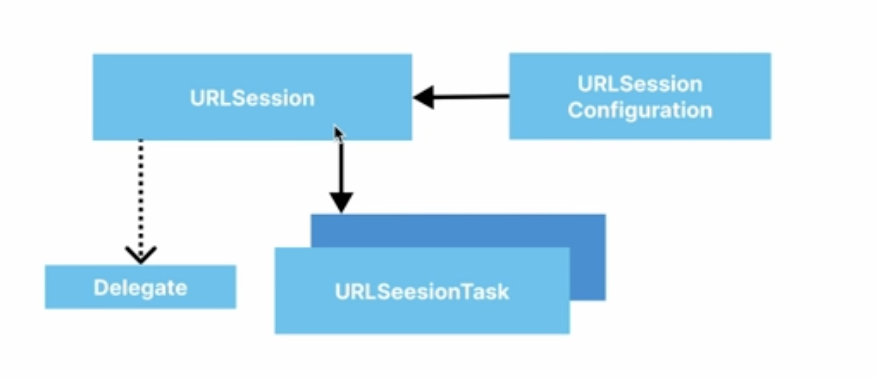

# iOS에서 네트워킹 하기

### Intro
- 앞서 배운 HTTP 방식으로 네트워크 할 수 있음
- iOS 네트워크 작업을 도와주는 것이 `URL Session`임

### URL Session
- `URLSession`을 이용해서 서버와 소통
  -  URLSessionConfiguration
  -  `.default`
     -  디스크를 이용한 정보 저장을 하는 configuration
     -  그냥 브라우저 띄울 때
  -  `.ephemral`
     -  default랑 비슷한데, 몇가지 정보들을 저장하지 않음(쿠키,인증서 등)
     -  브라우저 시크릿 모드라고 생각하면 쉬움
  -  `.background`
     -  네트워크를 통해 파일 다운로드 받을 때
     -  앱이 백그라운드에서 돌 때도 다운로드 시켜줄 수 있음
  -  `URLSession`
     -  configuration을 보고 세션을 생성
  -  `URLSessionTask`
     -  dataTask
     -  uploadTask
     -  downloadTask

- URLSession 구조도

### Codable
- swift 객체를 외부 데이터 형태(주로 JSON)로 인코딩,디코딩이 가능하게 해주는 타입
- 네트워크 응답형태로 JSON이 거의 표준으로 사용
- Codable을 이용하면,JSON과 swift 객체간 전환이 매우 쉬움

### URLSession + Combine
- URLSessionDataTask 에 대해서 publisher 제공
  -  따라서, 비동기 응답에 대한 작업이 더 수월함
-  [3대장 : Publisher/Subscriber/Operator](https://opposite-foundation-5b5.notion.site/3-Publisher-Subscriber-Operator-daed25711f5a480c996acf2123915c19)